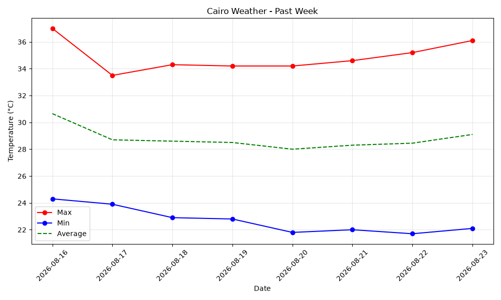

# Cairo Weather Analysis

A small Python project that pulls the past 7 days of temperature data for Cairo from a public weather API, processes it with pandas, and visualizes the trend with matplotlib.

## What it does

1. Fetches daily max/min temperatures for Cairo (past 7 days) from the [Open-Meteo API](https://open-meteo.com/)
2. Loads the data into a pandas DataFrame and computes the daily average temperature
3. Plots max, min, and average temperature over the week
4. Saves the chart (`.png`) and the raw data (`.csv`) to `Analysis/data/`

## Tech used

- `requests` — calling the weather API
- `pandas` — structuring and processing the data
- `matplotlib` — plotting the temperature trend

## How to run

```bash
pip install requests pandas matplotlib
python weather_analysis.py
```

## Output

- `Analysis/data/weather_chart.png` — line chart of max/min/average temperature over the past week
- `Analysis/data/paris_weather.csv` — the underlying data
- Console output showing the average temperature for the week

**Note:** if you update the script's `latitude`/`longitude` to Cairo's coordinates (30.04, 31.24) and change the plot title to "Cairo Weather - Past Week", make sure those match here too.

## Example



## What I learned

- Making GET requests to a public API and parsing JSON responses
- Structuring API data into a pandas DataFrame
- Basic date handling with `datetime` and `timedelta`
- Plotting time series data with matplotlib
- Saving outputs to a project folder programmatically
